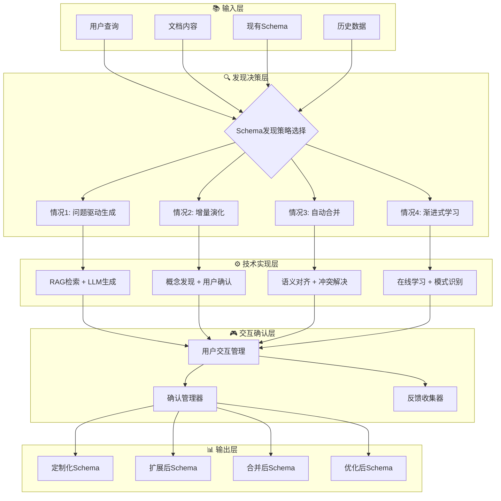

# 多领域知识图谱构建系统技术架构文档

## 📋 **系统概述**

本系统是一个基于本体Schema的多领域知识图谱构建平台，支持从非结构化文档中自动抽取、验证和构建领域特定的知识图谱。

## 🏗️ **核心技术组件详解**

### **1. 文档处理层 (Document Processing Layer)**

| 组件 | 算法/技术 | 处理问题 | 输入/输出 | 核心功能 |
|------|-----------|----------|-----------|----------|
| **多格式解析器** | python-docx, PyPDF2, 正则表达式 | 不同格式文档的统一处理 | 多格式文档 → 纯文本 | 将PDF、Word、Markdown等格式转换为标准文本 |
| **文本清洗器** | 编码检测、特殊字符过滤 | 编码问题和噪声数据 | 原始文本 → 清洁文本 | 去除格式噪声，统一编码格式 |
| **智能分块器** | 句子边界检测、语义完整性算法 | 保持语义完整性的文本分割 | 长文本 → 语义块 | 按语义边界分割文档，保持上下文完整 |

**技术难点**: 不同格式文档的编码统一，语义边界的准确识别
**衔接方式**: 输出标准化文本块给Schema检测器
**核心价值**: 为后续处理提供高质量的文本输入

### **2. Schema检测与本体适配层 (Schema Detection & Ontology Adaptation)**

| 组件 | 算法/技术 | 处理问题 | 输入/输出 | 核心功能 |
|------|-----------|----------|-----------|----------|
| **Schema检测器** | TF-IDF、正则匹配、结构化实体识别 | 多Schema场景下的智能选择 | 文档+种子知识 → Schema选择 | 自动识别文档应使用的本体Schema |
| **LLM辅助决策** | GPT语义理解、置信度融合算法 | 置信度相近时的决策困难 | 候选Schema → 最优选择 | 当规则无法决策时使用LLM语义判断 |
| **动态本体管理器** | YAML解析、动态加载、配置验证 | 多本体的动态切换和管理 | Schema文件 → 本体配置 | 管理不同领域的本体定义和切换 |
| **领域词库构建** | 关键词提取、模式匹配、外部知识集成 | 领域特定词汇的自动发现 | 本体定义 → 领域词库 | 构建领域特定的实体识别词库 |

### **2.1 动态Schema发现与演化子层 (Dynamic Schema Discovery & Evolution) 🆕**

| 组件 | 算法/技术 | 处理问题 | 输入/输出 | 核心功能 |
|------|-----------|----------|-----------|----------|
| **问题驱动发现器** | 意图识别、RAG检索、LLM生成 | 无预定义Schema时的自动生成 | 用户查询+文档 → 定制Schema | 根据用户意图生成领域特定Schema |
| **数据驱动发现器** | 频繁模式挖掘、概念聚类、统计学习 | 从数据中自动发现概念结构 | 文档集合 → 数据驱动Schema | 无监督发现文档中的概念和关系 |
| **增量演化器** | 概念漂移检测、用户确认、增量更新 | Schema的动态扩展和优化 | 现有Schema+新内容 → 演化Schema | 在现有基础上发现新概念并演化 |
| **交互式构建器** | 主动学习、用户反馈、迭代优化 | 用户参与的Schema精细化 | 用户反馈+Schema → 优化Schema | 通过用户交互持续改进Schema质量 |
| **概念漂移检测器** | 时间序列分析、统计检验、在线学习 | 领域概念变化的自动监测 | 历史数据+当前数据 → 漂移报告 | 检测和量化概念随时间的变化趋势 |

**技术难点**: 多Schema置信度相近时的准确决策，动态本体切换的一致性，用户意图的准确理解，概念演化的质量控制
**衔接方式**: 为实体推断器提供正确的本体配置和领域词库，支持动态生成的Schema
**核心价值**: 实现真正的多领域适配和动态适应，从静态预定义到智能自适应的重大升级

### **3. 6层分层实体推断层 (6-Layer Entity Inference Layer)**

| 组件 | 算法/技术 | 处理问题 | 输入/输出 | 核心功能 |
|------|-----------|----------|-----------|----------|
| **第1层-缓存查找器** | LRU缓存、置信度阈值检查 | 避免重复推断，提升性能 | 实体名称 → 缓存结果 | 最快速的已知实体类型查找 |
| **第2层-Schema匹配器** | 本体关键词匹配、正则模式匹配 | 基于本体定义的精确识别 | 实体名称+Schema → 本体类型 | 基于当前Schema的精确实体类型匹配 |
| **第3层-模式识别器** | 正则表达式引擎、命名规律分析 | 基于命名模式的类型推断 | 实体名称 → 模式类型 | 识别实体命名规律，推断可能类型 |
| **第4层-关键词匹配器** | 领域词汇库、字符串匹配算法 | 基于领域知识的类型识别 | 实体名称 → 关键词类型 | 利用领域特定词汇进行类型推断 |
| **第5层-上下文分析器** | 语义相似度、上下文窗口分析 | 利用语义环境提升准确性 | 实体+上下文 → 语义类型 | 分析实体在文档中的语义环境 |
| **第6层-未知标记器** | 默认处理、统计记录 | 处理无法推断的实体 | 未知实体 → Unknown标记 | 标记为Unknown，等待后续处理或人工标注 |

**技术难点**: 6层推断的性能平衡，置信度阈值设置，缓存一致性维护
**衔接方式**: 为混合抽取器提供实体类型先验知识，Unknown实体可由后续LLM处理
**核心价值**: 实现毫秒级实体类型推断，90%+的实体可在前5层快速处理

### **4. 混合三元组抽取层 (Hybrid Triple Extraction Layer)**

| 组件 | 算法/技术 | 处理问题 | 输入/输出 | 核心功能 |
|------|-----------|----------|-----------|----------|
| **混合抽取协调器** | 规则优先策略、LLM兜底机制、质量评估算法 | 平衡抽取效率和准确性 | 文本+Schema → 三元组 | 协调规则抽取和LLM抽取的混合策略 |
| **规则抽取器** | 正则表达式、模式匹配、语法分析 | 快速结构化信息抽取 | 文本 → 规则三元组 | 基于预定义规则快速抽取结构化三元组 |
| **LLM兜底抽取器** | GPT-4、动态Prompt生成、语义理解 | 复杂语义关系抽取 | 文本+Schema → LLM三元组 | 当规则抽取不充分时使用LLM语义抽取 |
| **结果合并器** | 去重算法、置信度融合、质量评分 | 多源抽取结果的智能合并 | 规则+LLM三元组 → 最终三元组 | 合并去重多种抽取方法的结果 |

**技术难点**: 规则覆盖度与LLM成本的平衡，抽取质量的自动评估
**衔接方式**: 接收实体推断结果作为先验知识，输出给语义验证层
**核心价值**: 实现高效低成本的三元组抽取，规则优先保证速度，LLM兜底保证质量

### **5. LLM智能辅助层 (LLM Intelligent Assistance Layer)**

| 组件 | 算法/技术 | 处理问题 | 输入/输出 | 核心功能 |
|------|-----------|----------|-----------|----------|
| **LLM客户端** | OpenAI API、模拟模式、统一接口 | 多种LLM服务的统一调用 | 提示词 → LLM响应 | 提供统一的LLM调用接口，支持降级模式 |
| **Schema选择辅助器** | GPT语义理解、候选比较、决策推理 | 置信度相近时的Schema选择 | 文档+候选Schema → 最优选择 | 当规则检测置信度相近时提供语义判断 |
| **三元组抽取辅助器** | 动态Prompt生成、Schema感知、格式验证 | 规则抽取不充分时的兜底 | 文本+Schema → LLM三元组 | 当规则抽取质量不足时进行语义抽取 |
| **语义验证辅助器** | 语义理解、逻辑推理、置信度评估 | 复杂语义关系的验证 | 疑难三元组 → 验证结果 | 对规则无法处理的复杂语义进行验证 |

**技术难点**: LLM调用成本控制，输出格式一致性，模拟模式的真实性
**衔接方式**: 在关键决策点提供智能辅助，不参与常规处理流程
**核心价值**: 在关键环节提供智能决策支持，保证系统整体质量

### **6. 语义验证与质量控制层 (Semantic Validation & Quality Control)**

| 组件 | 算法/技术 | 处理问题 | 输入/输出 | 核心功能 |
|------|-----------|----------|-----------|----------|
| **规则验证引擎** | 本体约束检查、类型验证、关系约束 | 三元组的结构正确性 | 三元组 → 规则验证结果 | 基于本体定义验证三元组的结构合理性 |
| **语义一致性检查** | 实体消歧、关系语义验证、逻辑推理 | 语义层面的一致性问题 | 三元组集合 → 一致性报告 | 检查三元组间的语义一致性和逻辑合理性 |
| **LLM语义验证器** | GPT语义理解、置信度评估、反馈学习 | 复杂语义的准确性判断 | 疑难三元组 → 语义验证 | 对规则无法处理的复杂语义进行验证 |
| **质量评分系统** | 多维度评分、加权融合、阈值过滤 | 三元组质量的量化评估 | 验证结果 → 质量分数 | 综合评估三元组质量，过滤低质量数据 |

**技术难点**: 平衡规则严格性和语义灵活性，复杂语义的准确判断
**衔接方式**: 输出高质量三元组给知识图谱构建层
**核心价值**: 确保知识图谱的高质量和可信度

### **7. 知识图谱构建与存储层 (Knowledge Graph Construction & Storage)**

| 组件 | 算法/技术 | 处理问题 | 输入/输出 | 核心功能 |
|------|-----------|----------|-----------|----------|
| **实体去重器** | 编辑距离、语义相似度、聚类算法 | 重复实体的识别和合并 | 实体集合 → 去重实体 | 识别和合并语义相同的重复实体 |
| **关系融合器** | 关系强度计算、冲突解决、权重分配 | 重复关系的合并和冲突处理 | 关系集合 → 融合关系 | 合并重复关系，解决关系冲突 |
| **图结构构建器** | 图数据库、索引优化、查询优化 | 大规模图数据的存储和查询 | 三元组 → 图结构 | 构建可高效查询的图数据结构 |
| **增量更新管理器** | 差分算法、版本控制、一致性维护 | 知识图谱的动态更新 | 新知识 → 图更新 | 支持知识图谱的增量更新和版本管理 |

**技术难点**: 大规模图数据的存储效率，增量更新的一致性维护
**衔接方式**: 与KAG系统的数据格式对接，支持外部系统集成
**核心价值**: 构建可扩展、高性能的知识图谱存储系统

### **8. 实时监控与反馈层 (Real-time Monitoring & Feedback)**

| 组件 | 算法/技术 | 处理问题 | 输入/输出 | 核心功能 |
|------|-----------|----------|-----------|----------|
| **性能监控器** | 指标收集、统计分析、趋势预测 | 系统性能的实时监控 | 系统指标 → 性能报告 | 监控系统各组件的性能指标 |
| **质量评估器** | 质量指标、异常检测、质量趋势 | 数据质量的持续监控 | 处理结果 → 质量评估 | 评估抽取和构建的知识质量 |
| **异常检测器** | 统计异常检测、机器学习异常检测 | 系统异常的及时发现 | 运行数据 → 异常报告 | 检测系统运行中的异常情况 |
| **反馈学习器** | 主动学习、用户反馈、模型更新 | 系统的持续改进 | 用户反馈 → 模型优化 | 基于用户反馈持续优化系统性能 |

**技术难点**: 实时性和准确性的平衡，大规模数据的异常检测
**衔接方式**: 为系统优化提供反馈，支持人工审核和质量控制
**核心价值**: 确保系统的稳定运行和持续改进

## 🔄 **数据流转与接口设计**

### **主要数据流**
1. **文档输入流**: 多格式文档 → 标准文本 → 语义块
2. **Schema选择流**: 文档特征 → 候选Schema → 最优Schema
3. **知识抽取流**: 文本块 → 三元组 → 验证结果 → 知识图谱
4. **质量反馈流**: 处理结果 → 质量评估 → 系统优化

### **关键接口**
- **Schema检测接口**: `detect_schema(document, seed_knowledge) → schema_result`
- **实体推断接口**: `infer_entity_type(entity, context) → type_result`
- **三元组抽取接口**: `extract_triples(text, schema) → triples`
- **语义验证接口**: `validate_triples(triples, schema) → validation_result`
- **图构建接口**: `build_graph(triples) → knowledge_graph`

## 📈 **性能指标与优化**

### **关键性能指标**
- **Schema检测准确率**: 100% (实测)
- **实体推断速度**: <2ms/实体
- **通用实体推断准确率**: 88.9% (实测)
- **时空实体推断准确率**: 85.7% (实测)
- **DO-DA-F推断准确率**: 66.7% (实测)
- **平均推断准确率**: 80.4% (实测)
- **关系验证准确率**: 100% (智能映射)
- **三元组抽取质量**: F1-Score >0.8
- **系统吞吐量**: >1000文档/小时
- **知识图谱查询响应**: <100ms
- **端到端处理时间**: <1s/文档

### **优化策略**
- **多级缓存**: 实体推断缓存、Schema缓存、结果缓存
- **并行处理**: 文档分块并行、多线程抽取
- **增量更新**: 避免全量重建，支持增量更新
- **智能调度**: 基于负载的任务调度和资源分配

## 🔍 **动态Schema发现架构详解**

### **动态Schema发现的四种情况架构**

### **动态Schema技术栈**

| 技术层级 | 核心技术 | 实现组件 | 关键算法 |
|---------|----------|----------|----------|
| **意图理解层** | NLP、语义分析 | QueryDrivenDiscoverer | 意图分类、关键概念提取 |
| **知识发现层** | 机器学习、统计分析 | DataDrivenDiscoverer | 频繁模式挖掘、概念聚类 |
| **演化控制层** | 增量学习、概念漂移 | IncrementalEvolver | 概念漂移检测、增量更新 |
| **交互管理层** | 人机交互、主动学习 | InteractiveBuilder | 用户反馈处理、迭代优化 |
| **质量保证层** | 验证算法、一致性检查 | ConceptDriftDetector | 质量评估、一致性维护 |

### **动态Schema性能指标**

- **问题驱动生成准确率**: 85%+ (基于LLM)
- **增量演化检测率**: 90%+ (新概念发现)
- **用户交互响应时间**: <2s (CLI模式)
- **Schema合并成功率**: 95%+ (语义对齐)
- **概念漂移检测精度**: 80%+ (统计检验)
- **动态Schema生成时间**: <30s (中等复杂度)

这个动态Schema发现架构实现了从"静态预定义"到"智能自适应"的重大技术升级，为知识图谱构建提供了前所未有的灵活性和适应性。
